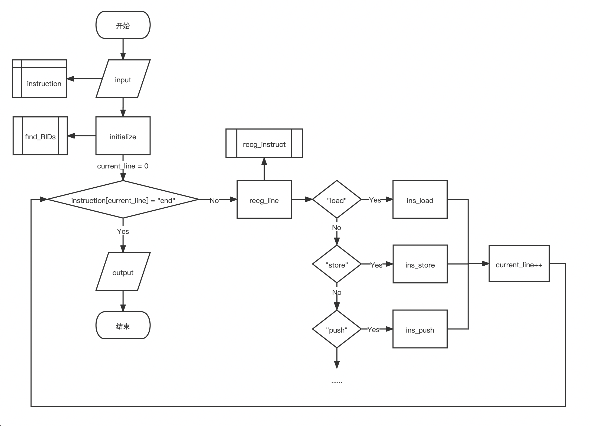

# ERISC
大一上, 程序设计基础, 大作业——ERISC程序可视化

由李可涵、李欣瑞、王昊华、马小龙共同完成，具体使用说明如下。


## 使用说明 

### 小组成员：

李可涵 计 04 2020010954 

李欣瑞 计 01 2020010873

王昊华 计 04 2020010942

马小龙 未央-工物 01 2020013082（队长） 

### 程序简介及基本功能完成情况 ：

#### 基本功能完成情况

- 作业要求中所有 ERISC 基础指令全部实现，四项必做任务及作业提交要求百分百完成。
- 运行时将先弹出交互界面，要求用户输入带后缀名的输入文件名称（要求该文件放在 input 文件夹中），输入后将运行整个程序，并将输出文档输出至 output 文件夹中。 

#### 程序运行思路梗概



在主函数中，首先输入函数（`input`）被调用，输入文件中的 ERISC 指令集以行为单位被存入二位字符串数组 `instruction` 中。接着全局初始化函数（`initialize`）被调用，搜索行标识函数（`find_RIDs`）被调用。至此，程序的预备工作全部结束，进入主循环 `while` （1）中。如果第 `current_line` （初始值为0）行指令是“`end`”，那么输出函数（`output`）被调用，循环打破，主函数结束；否则，`recg_line` 函数被调用。在 `recg_line` 中，相应行的ERISC指令类型被识别后对应功能的函数将被调用，`current_line` 会发生相应的变化。此时 `recg_line` 函数运行结束，程序进程返回至主函数。如果新的 `current_line` 对应行的指令不是 `end`，`recg_line` 函数将再次被调用，过程同上，直至遇到 `end` 指令跳出循环。 

#### 关于程序的其他说明 

1. 如果程序输入文件打开失败，程序将即刻终止并且在屏幕上输出“输入文件打开失败”。输出文件打开失败类似
2. 处于简化考虑，模拟内存中数据以 int 类型存储，在 `output` 函数中再依据小端访问原理输出
3. 输入的 ERISC 指令中空格和 回车要严格区分，不能在行前、行中、行尾多加空格，否则会影响“`recg_instruct`”函数执行，最终导致主函数死循环
4. 行标识起名不能过长，否则会引起记录表示的字符串越界
5. 由于本程序模拟的 ERISC 指令中所有连续 4 字节 内存是用 int 类型代表的，所以立即数、寄存器值、连续 4 个字节的内存值可储存的数都是 int 的范围，输出的内存是按补码形式呈现
6. 进行 load 和 store 指令时，涉及的内存地址应该是 4 的倍数，否则程序将自动取小于该地址的最大的4 的倍数

#### 全局变量的含义 

1. ```c++
   int register_[32]
   ```

   用于实时依次记录寄存器 x0~x31 内的值，初始值均为 0

2. ```c++
   bool register_r[32]
   ```

   用于依次记录寄存器 x0~x31被读取（read）的情况，初始值为 false，每次执行 draw 指令后赋值为 false，在相应的寄存器被读取时赋值为 true

3. ```c++
   bool register_w[32]
   ```

   用于依次记录寄存器 x0~x31被赋值（write）的情况，初始值为 false，每次执行 draw 指令后赋值为 false，在相应的寄存器被读取时赋值为 true

4. ```c++
   int memory[1048576]
   ```

   （1048576=1024×1024）用于依次记录内存中每连续的 4 个字节按小端访问原则储存的 32 位整数的值，初始值均为 0

5. ```c++
   bool memory_c[16]
   ```

   用于依次记录内存每连续的 256kB 被赋值或读取（change）的情况，初始值为 false，每次执行 draw 指令后赋值为 false，在相应的内存区间被读取或赋值时赋值为 true

6. ```c++
   int stack_[1048576]
   ```

   （1048576=1024×1024）用于依次记录栈空间中每连续的4个字节储存的 32 位整数的值，初始值均为 0

7. ```c++
   bool stack_c
   ```

   记录栈的使用情况，初值为 false，执行 draw 指令后赋值为 false，在栈空间被使用时赋值为 true

8. ```c++
   int pointer
   ```

   记录当前栈顶指向的地址，初始值为 4M

9. ```c++
   char instruction[200][50]
   ```

   用于以行为单位读取输入的 ERISC 指令，`char[i]` 指向输入的 ERISC 指令第 i 行（从第 0 行开始计）整行的指令字符串

10. ```c++
    int current_line
    ```

    用于记录程序执行的当前行的行数，初值为 0

11. ```c++
    int sumRIDs
    ```

    记录含有行标识的指令的总行数

12. ```c++
    int total_line
    ```

    记录输入的 ERISC 指令的总行数

13. ```c++
    int cnt_draw
    ```

    用于记录 draw 指令执行的总次数

14. ```c++
    struct rids{
    		int row;
    		char inst[50];
    }RIDs[200];
    ```

    记录所有含行标识指令的行号和具体指令内容

#### 各函数的功能 

1. ```c++
   int main()
   ```

   主函数，调用函数 `input()` 指令输入，调用初始化函数 `initialize()` ，寻找行标识符函数 `find_RIDs()` ，并且进入主循环 `while` 中，遇到 `end` 则调用 `output()` 后跳出循环，结束程序

   ```c++
   void initialize()
   ```

   所有变量的初始化

   ```c++
   void find_RIDs（）
   ```

   用于搜索并记录所有含有标识符的行的行号和相应的 ERISC 指令

   ```c++
   void input（）
   ```

   从输入文件中读取 ERISC 指令到数组 `instruction` 中

   ```c++
   void output()
   ```

   输出 result.txt 文档

   ```c++
   void initialize_draw()
   ```

   每一次执行 draw 命令后将所有的 bool 参量恢复成 0

2. ```c++
   bool recg_type(char a[])
   ```

   在某一段字符串可能是寄存器也可能是数字，用于识别该字符串的含义。返回 true 代表该字符串是数字，返回 0 代表该字符串是寄存器

   ```c++
   int recg_num(char a[])
   ```

   用于将代表（十进制或十六进制）数字的字符串转换成数字

   ```c++
   int recg_regs(char a[])
   ```

   用于识别寄存器名称，返回寄存器第一名称下标的数字

   ```c++
   string recg_instruct(int)
   ```

   用于识别该行指令内容，返回相应的指令字符串

   ```c++
   void recg_line(int)
   ```

   按照 `recg_instruct` 函数返回的字符串，调用相应 2. 中函数

3. ```c++
   void ins_draw()
   ```

   绘制可视化输出文件

4. ```c++
   void ins_load(int)
   void ins_store(int)
   void ins_push(int)
   void ins_pop(int)
   void ins_mov(int)
   void ins_add(int)
   void ins_sub(int)
   void ins_mul(int)
   void ins_div(int)
   void ins_rem(int)
   void ins_and(int)
   void ins_or(int)
   void ins_jal(int)
   void ins_beq(int)
   void ins_bne(int)
   void ins_blt(int)
   void ins_bge(int)
   void ins_call(int)
   void ins_draw(int)
   ```

   以上函数分别用于实现 ERISC 指令集中相应指令的操作要求

5. ```c++
   void stack_push(int)
   int stack_pop()
   ```

   用于在执行 push、pop 和函数调用指令的时候具体实现入栈和出栈的操作

### 小组分工情况：

#### 马小龙（组长）

- 拟定所需全局变量的名称与含义；
- 编写及调试部分函数，包括 1. 中 `main`、`input`、`output`、`initialize`、`initialize_draw`、`recg_RIDs`；4. 中`ins_add`、`ins_sub`、`ins_mul`、`ins_div`、`ins_rem`、`ins_and`、`ins_or`、`ins_call`、`ins_jal`、`ins_bne`、`ins_blt`、`ins_bge`；
- 撰写说明文档。

#### 李欣瑞

- 带领全员梳理程序整体思路、拟定大部分需要编写的函数；
- 编写及调试部分函数，包括 2. 中 `recg_instruct`、3. 中 `ins_draw`、5. 中 `stack_push`、 `stack_pop`；
- 编写测试性 ERISC 指令文件，进行各项功能的动态调试 debug。 

#### 李可涵

- 编写及调试部分函数，包括 4. 中 `ins_mov`、`ins_push`、`ins_pop`、`ins_store`、`ins_load`；
- 编写必做任务 5.3、5.4 中的两个 ERISC 指令。

#### 王昊华 

- 部分函数的编写与调试，包括 2. 中 `recg_type`、`recg_num` 、`recg_regs`； 
- 将所有程序合并成总工程，梳理程序间调用关系，建立头文件； 
- 录制演示视频 。 
